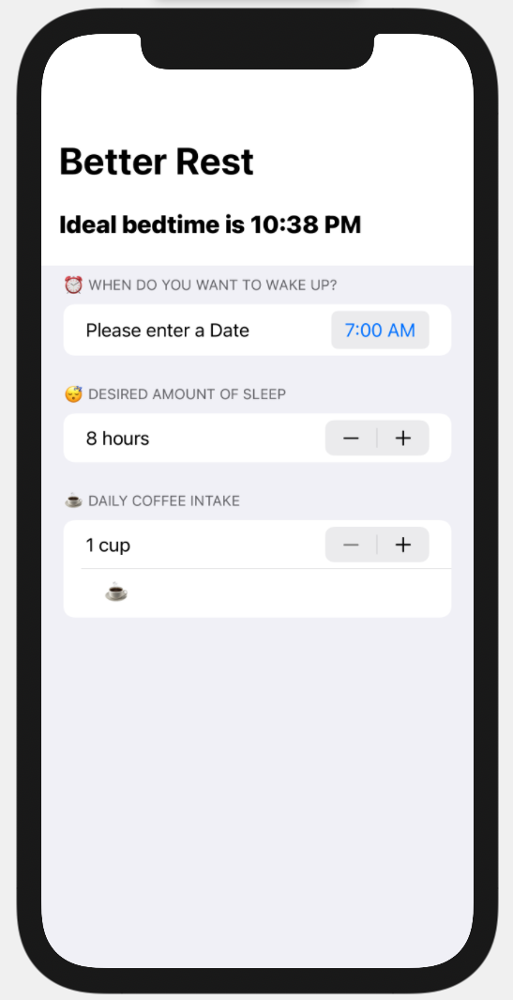

# Better Rest 🛌

A simple app that use machine learning to predict which time is the best to go to bed and sleep well :)

## Technical approach
**CoreML + Swift UI** from the Hacking with Swift Book by [Paul Hudson](https://github.com/twostraws)

🤌 Go buy his books and other stuff he make, very high quality.

---
> For more good stuff star me on Github or follow me on [Async Tech Blog](https://blog.async-agency.com)